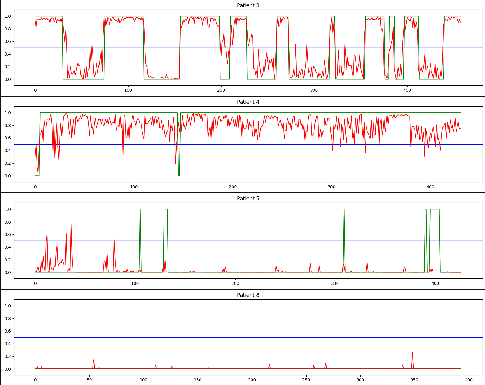

# OSA detection

## Using the CLI

```zsh
python3 src/model.py -h
```

## Data

### Preprocess data

```zsh
python3 src/preprocess.py *unit*
```

> **_NOTE:_** Data unit is how many parts is 1-minute interal being sliced equally

#### Data source:

Dataset: [Apnea-ECG Database](https://physionet.org/content/apnea-ecg/1.0.0/)

### Patients used _(These patients have needed signals)_

1. a01
1. a02
1. a03
1. a04
1. b01
1. c01
1. c02
1. c03

-   ##### Patients without OSA: 6, 7, 8
-   ##### Patients have witness most OSA: 1, 4

## Final decision

### Train

```zsh
python3 src/model.py --fit "1, 2, 6, 7" --eval ""
```

> **_NOTE:_** These are ideal patients after various experiments

### Evaluation on unseen data

```
accuracy: 0.9185 - loss: 0.3036
```

# Result on unseen patients


The prediciton is based on mean of 6 continuous prediction (since the trained data is sliced from 1-minute duration to 10-second duration)

## Note

-   After download the data, rename the folder to "database"
-   The preprocessed data of patients is stored in the folder named "numpy" (the program itself automatically create the folder) in binary format
-   The model will be saved at the folder named "res" (it is automatically created)
-   Please run the program at the root folder
-   For every annotation for every 6000 signal (100 signals per second) is sliced into 6 10-second intervals
-   I only use two signal (RespN and SpO2) for training
-   It is important to shuffle the data well which to ensure the postive cases and negative cases are well mixed and make them interspersed (the current seed after tested is 22022009)
-   School project UwU
